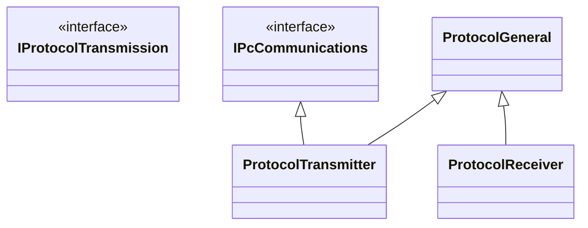

# Protocol Parser
## Overview
This library deals with parsing and generation of communications packets between this firmware and a PC to the requirements of the protocol defined at https://github.com/VolksEEG/VolksEEG/wiki/FrontEndToPcApi.

## Architecture 
**Note** this diagrma is not complete.
